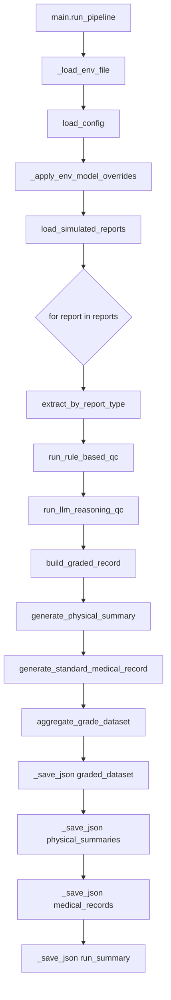
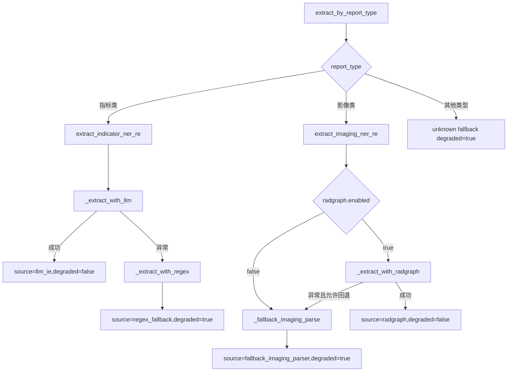
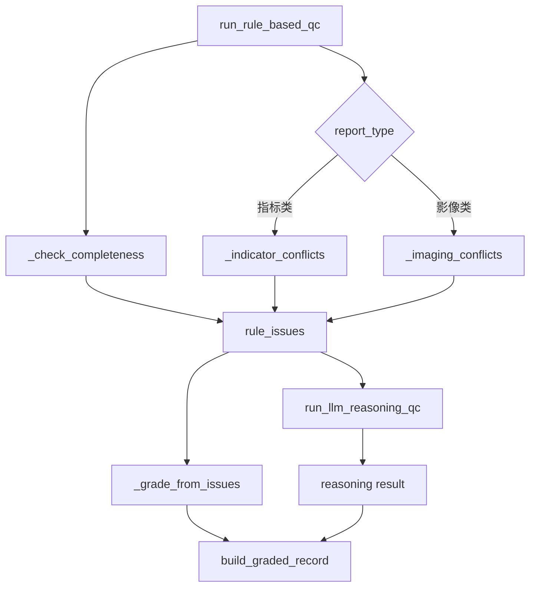
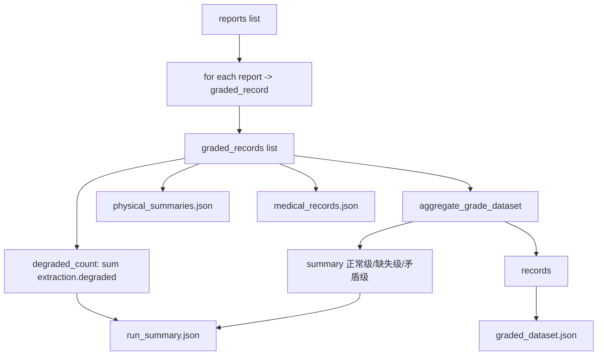

# electronic-record 项目代码与数据分析说明

## 1. 项目定位与整体流程

该项目是一个医疗检查报告质控与结构化生成的流水线，核心目标是：

1. 读取模拟报告数据并做格式规范化。
2. 按报告类型做信息抽取（指标类、影像类）。
3. 执行规则质控，再用 LLM 做补充推理质控。
4. 将质控结果分级（正常级/缺失级/矛盾级）。
5. 基于分级结果生成体检总结和标准化病历。
6. 输出结构化数据集和运行摘要。

主流程位于 `main.py` 的 `run_pipeline()`：

- 加载配置：`config/qc_rules.json` + `config/model_config.json`
- 读取数据：`data/simulate_data.json`
- 报告逐条处理：抽取 -> 规则质控 -> 推理质控 -> 分级 -> 生成文书
- 落盘输出：`outputs/<timestamp>/`

---

## 2. 根目录 Python 文件分析

### 2.1 main.py

职责：项目入口与全链路编排。

实现细节：

1. 路径与环境准备
- 使用 `Path(__file__).resolve().parent` 计算项目根目录。
- 将根目录插入 `sys.path`，保证本地包可导入。
- `_load_env_file()` 支持从 `.env` 加载键值对到进程环境变量。

2. 模型配置覆盖
- `_apply_env_model_overrides()` 允许通过环境变量覆盖模型配置中的 `llm.model` 与 `llm.base_url`。
- 覆盖键为 `DEEPSEEK_MODEL` 与 `DEEPSEEK_BASE_URL`。

3. 流水线执行
- 对每条报告调用：
  - `extract_by_report_type()`
  - `run_rule_based_qc()`
  - `run_llm_reasoning_qc()`
  - `build_graded_record()`
  - `generate_physical_summary()`
  - `generate_standard_medical_record()`
- 聚合结果：`aggregate_grade_dataset()`。

4. 输出持久化
- `_save_json()` 统一 JSON 输出（UTF-8，`ensure_ascii=False`，缩进 2）。
- 输出四个文件：
  - `graded_dataset.json`
  - `physical_summaries.json`
  - `medical_records.json`
  - `run_summary.json`

5. 运行统计
- `degraded_count` 通过 `record.extraction.degraded` 统计降级提取次数。


### 2.2 use_llm_ie.py

职责：一个独立的实验/演示脚本，展示如何直接用 `llm-ie` 做抽取与质控，并输出多种格式。

实现细节：

1. 直接写死了 API 参数（`API_KEY`、`MODEL`、`BASE_URL`），与主工程通过配置文件驱动的方式不同。
2. 包含完整功能链：
- `extract_medical_info()`：调用 `DirectFrameExtractor` 抽取 JSON；内置大量兼容逻辑处理不同 frame 属性。
- `apply_rules()`：按指标/影像规则检查异常与矛盾。
- `llm_reasoning_qc()`：再做一次推理判定。
- `generate_case_summary()`：生成摘要。
- `save_results_multiple_formats()`：输出 JSON/TXT/Markdown。
3. 适合原型验证，不建议直接并入生产流程（配置和工程风格与 `main.py` 不一致）。

---

## 3. packages 逐包与逐文件分析（modules）

## 3.1 modules.data_process

### 3.1.1 modules/data_process/__init__.py

职责：包标识文件，当前只有模块说明字符串。


### 3.1.2 modules/data_process/data_loader.py

职责：数据与配置加载、输入数据规范化与校验。

核心函数：

1. `load_json_file(file_path)`
- 通用 JSON 文件读取。

2. `load_config(config_dir)`
- 加载并返回：
  - `qc_rules.json`
  - `model_config.json`

3. `_normalize_text(value)`
- 将字段统一为去空白后的字符串，`None` 转空串。

4. `validate_and_normalize_reports(raw_reports)`
- 校验顶层必需字段：`report_id/report_type/report_subtype/content/label`。
- 校验 `content` 结构并补齐 `描述/检查所见/检查提示`。
- 仅接受 `report_type in {"指标类", "影像类"}`。
- 返回规范化后的列表。

5. `load_simulated_reports(data_file)`
- 强制数据顶层是列表；再走规范化。

设计价值：
- 将“脏数据”挡在流水线前端，减少后续模块分支判断。

## 3.2 modules.ner_re

### 3.2.1 modules/ner_re/__init__.py

职责：按 `report_type` 路由抽取器。

实现细节：

- `extract_by_report_type()`：
  - 指标类 -> `extract_indicator_ner_re()`
  - 影像类 -> `extract_imaging_ner_re()`
  - 其他类型 -> 返回 `degraded=True` 的兜底结构（含错误信息）


### 3.2.2 modules/ner_re/indicator_ner_re.py

职责：指标类报告 NER/RE，优先 LLM，失败时回退正则。

实现细节：

1. 文本拼接
- `_build_text(report)` 将 `描述/检查所见/检查提示` 拼成多行输入。

2. 规则回退路径
- `_extract_with_regex(report, qc_rules)`：
  - 从 `qc_rules.indicator.ranges` 读取指标范围。
  - 对每个指标构造正则匹配数值和单位。
  - 计算 `status`（正常/异常）。
  - 输出统一结构：`entities` + `relations`。
- 标记：`source=regex_fallback`，`degraded=True`。

3. LLM 路径
- `_extract_with_llm(report, model_config)`：
  - 读取 `llm` 配置。
  - 从环境变量获取 API key（默认 `DEEPSEEK_API_KEY`）。
  - 动态导入 `llm-ie` 组件。
  - 用严格 JSON Prompt 抽取。
  - 兼容解析 `frame` 的多种文本字段。
  - 去掉 markdown 代码块后 `json.loads`。
- 成功时标记：`source=llm_ie`，`degraded=False`。

4. 对外接口
- `extract_indicator_ner_re()`：先 LLM，异常则自动回退正则并附 `error`。


### 3.2.3 modules/ner_re/imaging_ner_re.py

职责：影像类抽取，优先 RadGraph，失败回退词表规则解析。

实现细节：

1. 回退解析
- `_fallback_imaging_parse(report, qc_rules, reason)`：
  - 基于 anatomy/lesion 词表做浅层节点提取。
  - 为每个病变和解剖节点构造 `located_at` 边。
  - 输出 `nodes/edges/relations`。
  - 标记 `source=fallback_imaging_parser`，`degraded=True`。

2. RadGraph 解析
- `_extract_with_radgraph(report)`：
  - 动态导入 `radgraph`。
  - 兼容 `RadGraph` 或 `RadGraphParser` 类。
  - 兼容 `__call__` 或 `predict` 推理接口。
  - 从 RadGraph `entities` 映射构造 `nodes/edges`。
  - 将 Observation 前缀映射为 lesion，否则 anatomy。
  - 标记 `source=radgraph`，`degraded=False`。

3. 对外接口
- `extract_imaging_ner_re()`：读取 `model_config.radgraph`：
  - `enabled=false` 直接回退。
  - 若启用但失败且 `fallback_enabled=true`，则回退；否则抛错。

设计价值：
- 将可选依赖 (`radgraph`) 变为“增强能力”，非“硬依赖”。

## 3.3 modules.quality_control

### 3.3.1 modules/quality_control/__init__.py

职责：导出质控公共接口。


### 3.3.2 modules/quality_control/rule_based_qc.py

职责：规则质控核心，输出标准 issue 结构。

Issue 数据结构：

- `type`: 缺失/矛盾
- `severity`: high/medium
- `message`: 问题描述
- `evidence`: 证据对象
- `source`: 默认 `rule`

核心逻辑：

1. `_check_completeness(content, qc_rules)`
- 按 `completeness.required_fields` 检查空字段，产生缺失问题。

2. `_indicator_conflicts(extraction, qc_rules)`
- 检查指标是否超阈值（来自 `indicator.ranges`）。
- 若数值异常且结论出现“正常”关键词，再追加“提示矛盾”。
- 若结论有异常关键词但无指标实体，标注“抽取缺失”。

3. `_imaging_conflicts(report, extraction, qc_rules)`
- 所见含正常关键词且提示含异常关键词 -> 逻辑矛盾。
- 若文本出现病变关键词但缺少对应解剖关键词 -> 病变-解剖不匹配。

4. `run_rule_based_qc(report, extraction, qc_rules)`
- 先通用完整性，再按报告类型分支执行冲突检测。


### 3.3.3 modules/quality_control/llm_reasoning_qc.py

职责：在规则质控后，调用 LLM 做复核推理，输出 `result/reason/source`。

实现细节：

1. 配置控制
- `enable_reasoning_qc=false` 直接返回 unknown。

2. 环境依赖检测
- 缺 API key 或缺 `llm-ie` 时，返回 `source=fallback` 的 unknown，不中断主流程。

3. 推理调用
- 拼装报告、抽取结果、规则问题到 Prompt。
- 调用 `DirectFrameExtractor.extract("")` 获取结果。
- 清洗 markdown 代码块并解析 JSON。

4. 结果兜底
- 缺字段时补默认值，异常则返回 unknown + 错误原因。

设计价值：
- 把“推理失败”降级为“可观测状态”，而不是整条流水线失败。

## 3.4 modules.dataset

### 3.4.1 modules/dataset/__init__.py

职责：导出分级模块对外方法。


### 3.4.2 modules/dataset/grade_dataset.py

职责：根据规则问题给出分级标签，并聚合统计。

实现细节：

1. `_grade_from_issues(issues)`
- 优先级：矛盾级 > 缺失级 > 正常级。

2. `build_graded_record(report, extraction, rule_issues, reasoning)`
- 将原始报告、抽取结果、规则问题、推理结果整合为单条记录。

3. `aggregate_grade_dataset(records)`
- 统计三类分级数量，返回 `summary + records`。

## 3.5 modules.case_generation

### 3.5.1 modules/case_generation/__init__.py

职责：导出体检总结与标准病历生成接口。


### 3.5.2 modules/case_generation/physical_summary.py

职责：生成体检总结文本。

实现细节：

1. 生成门禁
- `grade_label == 正常级` 或 `corrected=True` 才允许生成。
- 否则返回 `generated=False` 与提示 note。

2. 内容拼接
- 以患者信息开头。
- 指标实体列表格式化为 `name+value+unit(status)`。
- 附加检查提示作为结论。


### 3.5.3 modules/case_generation/medical_record.py

职责：生成标准化病历结构对象。

实现细节：

1. 生成门禁逻辑与 `physical_summary.py` 一致。
2. 构造 `base_record` 字段：
- `report_id/report_type/report_subtype`
- `患者信息/检查结果/异常提示/建议`
3. 非正常时仍返回 `record`，但 `generated=False` 并附 `pending_issues`。

---

## 4. 测试文件分析（tests）

### 4.1 tests/conftest.py

职责：将项目根目录加入 `sys.path`，保证 pytest 可导入本地模块。


### 4.2 tests/test_data_loader.py

职责：验证数据加载与结构规范。

断言点：
- 报告数量至少 10。
- 顶层字段和 `content` 子字段集合符合预期。


### 4.3 tests/test_grade_dataset.py

职责：验证分级优先级和汇总统计。

断言点：
- 同时出现“缺失+矛盾”时必须判为 `矛盾级`。
- 汇总计数字典与输入记录一致。


### 4.4 tests/test_imaging_ner_re.py

职责：验证影像抽取在 RadGraph 关闭时走回退分支。

断言点：
- `degraded=True`
- `source=fallback_imaging_parser`
- `nodes/edges` 为列表结构。


### 4.5 tests/test_main_pipeline.py

职责：通过 monkeypatch 做主流程集成测试（去除外部依赖）。

实现细节：

1. mock 配置加载、数据加载、抽取、规则质控、推理质控。
2. 将输出目录重定向到 `tmp_path`。
3. 断言：
- `total_reports=2`
- `summary[正常级]=2`
- `degraded_count=0`
- 四个输出文件存在且 `run_summary.json` 内容正确。

---

## 5. JSON 文件分析

## 5.1 config/model_config.json

作用：集中管理模型相关参数。

关键字段：

1. `llm`
- `provider`: 推理后端类型（这里是 litellm）
- `model`: 模型名
- `base_url`: API 地址
- `api_key_env`: API key 环境变量名
- `enable_reasoning_qc`: 是否启用推理质控

2. `radgraph`
- `enabled`: 是否启用 RadGraph 抽取
- `fallback_enabled`: RadGraph 失败时是否允许回退
- `backend/notes`: 说明信息


## 5.2 config/qc_rules.json

作用：规则质控知识库。

结构说明：

1. `completeness.required_fields`
- 通用必填字段列表。

2. `indicator`
- `ranges`: 指标阈值和单位
- `normal_keywords`: 正常语义关键词
- `abnormal_keywords`: 异常语义关键词

3. `imaging`
- `normal_keywords` 与 `abnormal_keywords`
- `lesion_anatomy_map`: 病变与解剖结构的弱约束映射

4. `grading.priority`
- 分级优先级配置（当前代码中的实际优先级逻辑在 `grade_dataset.py` 内实现）。


## 5.3 data/simulate_data.json

作用：模拟输入报告数据集。

特点：

1. 数据规模：10 条。
2. 类型覆盖：指标类 + 影像类。
3. 标签覆盖：正常、缺失、矛盾。
4. 字段结构统一：
- `report_id/report_type/report_subtype/content/label`
- `content` 含 `描述/检查所见/检查提示`

价值：
- 兼顾正常样本和故障样本，便于验证完整流水线与降级逻辑。


## 5.4 outputs/20260317_224211/*.json（样例输出）

作用：展示流程执行后的产物形态。

1. `run_summary.json`
- 摘要统计：正常 4、缺失 4、矛盾 2、总计 10。

2. `graded_dataset.json`
- 每条记录包含：原报告、抽取结果、规则问题、推理结果、最终分级。

3. `physical_summaries.json`
- 仅正常级生成总结；问题样本返回空总结与提示。

4. `medical_records.json`
- 即便不生成正式病历，也返回基础记录和 `pending_issues`，便于后续人工修订。

---

## 6. 设计优点与可改进点

设计优点：

1. 强鲁棒性：多处采用“外部依赖失败 -> 降级返回”的容错设计。
2. 模块清晰：加载、抽取、质控、分级、生成解耦。
3. 可测性好：核心分级、加载、主流程都具备自动化测试。

可改进点：

1. `use_llm_ie.py` 与主工程配置体系不一致，建议统一到 `config/` 驱动。
2. `qc_rules.grading.priority` 目前主要用于文档语义，分级逻辑未直接读取该配置，可考虑参数化。
3. `outputs` 样例中出现的 `output_dir` 路径含 `medical_qc_framework` 字样，建议检查历史目录迁移后的路径一致性。
4. 影像回退词表目前是内置常量，建议迁移到配置文件便于扩展。

---

## 7. 快速结论

该项目已经形成一个可运行、可测试、可降级的医疗报告质控框架：

1. 数据输入规范化做得较好。
2. NER/RE 层实现了 LLM/规则双路径和影像可选依赖回退。
3. 质控逻辑清晰，分级优先级明确。
4. 下游文书生成与问题挂钩，业务闭环完整。

如果后续要走生产化，优先建议：统一配置管理、强化日志与可观测性、把规则词表全部配置化。

---

## 8. 函数级调用链图

### 8.1 主流程调用链（run_pipeline）



### 8.2 抽取子链路（按报告类型分发）



### 8.3 质控与分级子链路



---

## 9. 字段流转图

### 9.1 报告级字段流转（单条 report）

```mermaid
flowchart LR
  A[data.simulate_data[].report] --> B[validate_and_normalize_reports]
  B --> C[normalized report]

  C --> D[extract_by_report_type]
  D --> E[extraction.entities]
  D --> F[extraction.relations nodes edges]
  D --> G[extraction.source degraded error]

  C --> H[run_rule_based_qc]
  E --> H
  H --> I[qc_issues]

  C --> J[run_llm_reasoning_qc]
  D --> J
  I --> J
  J --> K[reasoning.result reason source]

  C --> L[build_graded_record]
  D --> L
  I --> L
  K --> L
  L --> M[graded_record]

  M --> N[generate_physical_summary]
  M --> O[generate_standard_medical_record]
```

### 9.2 数据集级字段汇聚流转



### 9.3 关键字段映射表（输入 -> 中间 -> 输出）

1. `report_id`
- 输入：`simulate_data[].report_id`
- 中间：`graded_record.report_id`
- 输出：`graded_dataset.records[].report_id`、`physical_summaries[].report_id`、`medical_records[].report_id`

2. `report_type/report_subtype`
- 输入：原始报告顶层字段
- 中间：用于 `extract_by_report_type` 路由及分支规则质控
- 输出：`graded_dataset.records[]` 与 `medical_records[].record`

3. `content.描述/检查所见/检查提示`
- 输入：原始文本域
- 中间：
  - 参与抽取输入文本构建
  - 参与完整性检查与冲突检查
  - 在抽取缺省时作为回填来源
- 输出：`graded_dataset.records[].content`、`medical_records[].record`、`physical_summaries[].summary`

4. `extraction.entities.指标[*]`
- 输入来源：LLM 抽取或正则回退
- 中间：用于指标阈值检测和文本生成
- 输出：`graded_dataset.records[].extraction.entities.指标` 与体检总结指标串

5. `qc_issues`
- 中间产生：`run_rule_based_qc`
- 影响：
  - `grade_label`（矛盾级 > 缺失级 > 正常级）
  - 是否允许生成总结/正式病历
- 输出：`graded_dataset.records[].qc_issues`、`medical_records[].pending_issues`

6. `reasoning`
- 中间产生：`run_llm_reasoning_qc`
- 输出：`graded_dataset.records[].reasoning`

7. `grade_label`
- 中间产生：`build_graded_record`
- 影响：下游文书生成门禁
- 输出：`graded_dataset.records[].grade_label`，并汇总到 `run_summary.summary`

---

## 10. outputs 子文件夹与 JSON 字段详解

## 10.1 outputs 各子文件夹作用

当前 `outputs/` 下每个子文件夹名都是一次运行的时间戳（如 `20260317_223319`、`20260317_223549`、`20260317_224211`），表示一次完整流水线执行的结果快照。

每个时间戳目录都包含相同 4 个文件：

1. `graded_dataset.json`
2. `physical_summaries.json`
3. `medical_records.json`
4. `run_summary.json`

这使得你可以：

1. 横向比较不同时间运行（配置变更、模型变更、规则变更）后的差异。
2. 做可回溯审计（某次运行到底输出了什么）。

## 10.2 run_summary.json

文件作用：一次运行的“总览面板”，用于快速看运行是否符合预期。

字段说明：

1. `output_dir`（string）
- 本次运行输出目录的绝对路径。
- 用途：快速定位同批次其他 3 个文件。

2. `summary`（object）
- 分级汇总：`正常级`、`缺失级`、`矛盾级` 的计数。
- 来源：`aggregate_grade_dataset(records).summary`。

3. `total_reports`（int）
- 本次处理的报告总数。
- 期望关系：`total_reports == summary.正常级 + summary.缺失级 + summary.矛盾级`。

4. `degraded_count`（int）
- 抽取阶段发生降级的报告数量。
- 统计口径：`sum(record.extraction.degraded == true)`。
- 判读建议：
  - 若突然升高，通常表示外部依赖异常（如 LLM Key 缺失、radgraph 不可用）。

## 10.3 graded_dataset.json

文件作用：全量主数据，包含每条报告从输入到分级的完整链路信息。

顶层字段：

1. `summary`（object）
- 与 `run_summary.summary` 一致，用于快速统计。

2. `records`（array）
- 每条报告一条记录，是后续分析的主事实来源。

`records[]` 字段说明：

1. `report_id`（string）
- 报告主键，用于跨文件关联。

2. `report_type`（string）
- 报告类型（指标类/影像类），决定抽取与规则分支。

3. `report_subtype`（string）
- 子类型（如血常规、CT、MRI）。

4. `original_label`（string）
- 输入样本原始标签（正常/缺失/矛盾），可用于对比模型判定结果。

5. `grade_label`（string）
- 流程最终分级（正常级/缺失级/矛盾级）。

6. `content`（object）
- 原始文本三字段：`描述`、`检查所见`、`检查提示`。

7. `extraction`（object）
- 抽取结果与抽取元数据，关键子字段：
  - `entities`：实体对象（患者信息、检查所见、检查提示、指标等）。
  - `relations`：关系数组（指标类常见“指标-数值”；影像类可与 edges 对齐）。
  - `nodes` / `edges`：影像图结构（有些样本可能为空）。
  - `source`：抽取来源（`llm_ie`、`radgraph`、`regex_fallback`、`fallback_imaging_parser`）。
  - `degraded`：是否降级。
  - `raw_output`：原始模型/解析器输出（便于排错追踪）。
  - `error`：降级或异常原因（仅部分场景存在）。

8. `qc_issues`（array）
- 规则质控问题列表。
- 每个 issue 常见字段：
  - `type`：`缺失` 或 `矛盾`
  - `severity`：`high` / `medium`
  - `message`：问题文案
  - `evidence`：证据对象
  - `source`：通常为 `rule`

9. `reasoning`（object）
- LLM 推理复核结果，常见字段：
  - `result`：`correct` / `error` / `unknown`
  - `reason`：原因说明
  - `source`：`llm_ie` / `fallback` / `config`

## 10.4 physical_summaries.json

文件作用：面向展示的体检总结输出集合。

数组项字段说明：

1. `report_id`（string）
- 关联键，对应 `graded_dataset.records[].report_id`。

2. `generated`（bool）
- 是否已生成总结。
- 判定逻辑：正常级或手动 `corrected=true` 时为 true。

3. `summary`（string）
- 总结正文。
- 当 `generated=false` 时通常为空字符串。

4. `note`（string）
- 未生成原因或补充说明。
- 常见值：提示存在缺失/矛盾，需修正后再生成。

## 10.5 medical_records.json

文件作用：标准化病历输出集合，兼顾“可生成”和“待修订”两类状态。

数组项字段说明：

1. `report_id`（string）
- 关联键。

2. `generated`（bool）
- 是否生成正式病历。

3. `record`（object）
- 基础病历结构，常见字段：
  - `report_id`
  - `report_type`
  - `report_subtype`
  - `患者信息`
  - `检查结果`
  - `异常提示`
  - `建议`

4. `pending_issues`（array）
- 待处理问题列表；若 `generated=true` 通常为空数组。
- 内容通常与 `graded_dataset.records[].qc_issues` 一致或同源。

5. `note`（string，可选）
- 当 `generated=false` 时给出不可生成正式病历的提示文案。

## 10.6 四个 JSON 的关联关系

可以把这 4 个文件理解为“同一批结果的 4 个视图”：

1. `graded_dataset.json`：主事实层（最全）
2. `run_summary.json`：汇总层（最简）
3. `physical_summaries.json`：总结文本视图
4. `medical_records.json`：标准病历视图

推荐关联键：统一用 `report_id`。

常用校验关系：

1. `run_summary.total_reports == len(graded_dataset.records)`
2. `run_summary.summary == graded_dataset.summary`
3. `len(physical_summaries) == len(medical_records) == len(graded_dataset.records)`
4. `run_summary.degraded_count == count(graded_dataset.records[].extraction.degraded == true)`

## 10.7 按子文件夹查看时的分析建议

当你比较 `outputs` 下不同时间戳目录时，建议按以下顺序：

1. 先看 `run_summary.json`
- 判断总量、分级结构、降级数量是否异常。

2. 再看 `graded_dataset.json`
- 定位具体异常记录、抽取来源变化和问题证据。

3. 最后看 `physical_summaries.json` 与 `medical_records.json`
- 检查业务可交付文本（是否生成、文案质量、待处理问题是否对齐）。